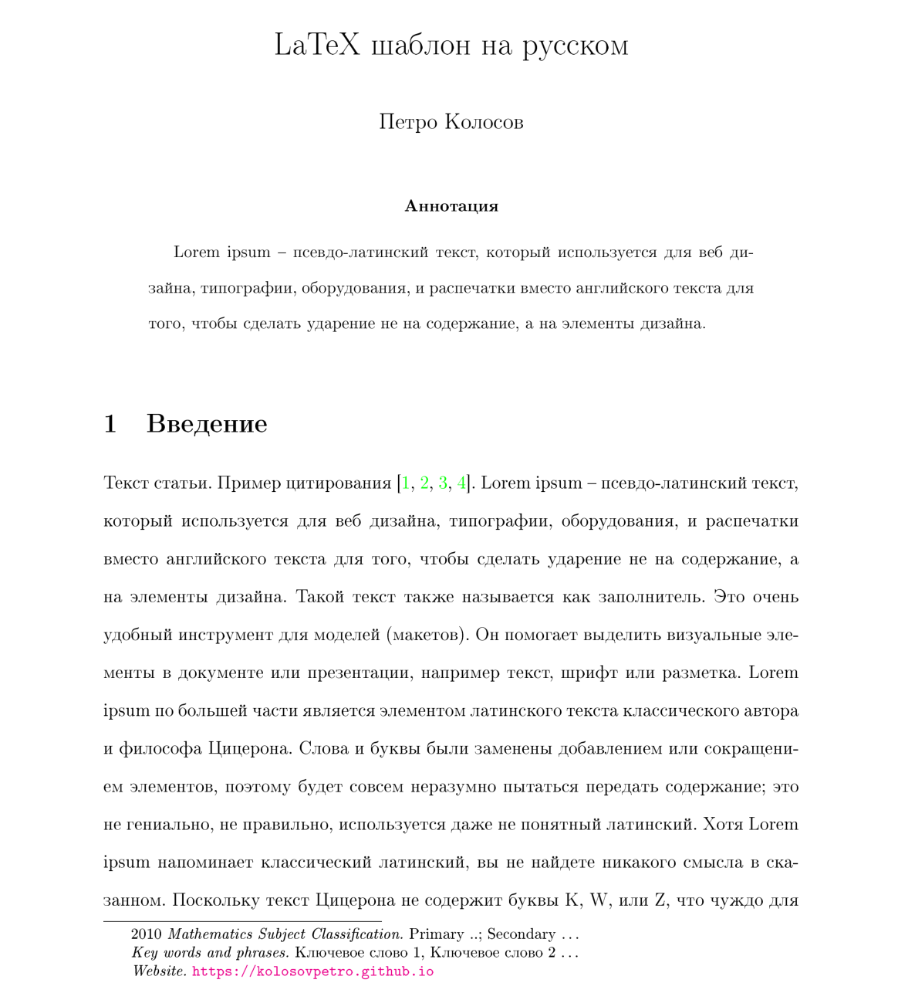

# LaTeX шаблон на русском

LaTeX шаблон на русском, который включает в себя базовую настройку CI/CD и шаблоны программ на языке Wolfram.

- https://dev.azure.com/PetroKolosovProjects/latex-russian-template

## Сборка документа с помощью PowerShell (Windows)

- Установить `MikTeX`: https://miktex.org/download
- Обновить `MikTeX`
- Установить `SumatraPDF`: https://www.sumatrapdfreader.org/download-free-pdf-viewer
- Запустить скрипт `Rename-Tex-Files.ps1`, который переименовывает основные файлы LaTeX и BibTeX, чтобы они
  соответствовали имени корневого каталога репозитория
- Запустить скрипт `Build-Latex.ps1`

## Сборка документа в Intellij IDEA (Windows)

- Установить `MikTeX`: https://miktex.org/download
- Обновить `MikTeX`
- Установить `SumatraPDF`: https://www.sumatrapdfreader.org/download-free-pdf-viewer
- Путь к SumatraPDF: `C:\Program Files\SumatraPDF`
- Установить `Intellij IDEA Ultimate` среду разработки: https://www.jetbrains.com/idea/download/#section=windows
- Активировать `Intellij IDEA Ultimate`, надеюсь у вас есть ключ
- Установить плагин `TeXiFy IDEA` для `Intellij IDEA Ultimate`: https://plugins.jetbrains.com/plugin/9473-texify-idea
- Склонировать данный репозиторий или используйте как шаблон на
  GitHub: `https://github.com/kolosovpetro/latex-russian-template.git`
- Откройте склонированный проект в среде разработки `Intellij IDEA Ultimate` и сконфигурируйте сборку документа
    - LaTeX Configuration
      
    - BibTeX Configuration
      
- Сконфигурируйте обратный поиск `Intellij IDEA` для `SumatraPDF`: `Tools -> LaTeX -> Configure Inverse Search`
- Запустите сборку документа сочитанием клавиш `Shift + F10`

## Конфигурация CI / CD

- Обновить имя корневого latex файла в `build-pdf.yml` и `build-and-deploy-pdf.yml`
- Для корректной работы CI / CD установите `GH_ACCESS_TOKEN` в секреты Github:
    - `GH_ACCESS_TOKEN`: Сгенерировать
      `Settings -> Developer Settings -> Personal access tokens -> Generate mew token`

## Политика срабатывания CI / CD

- `build-pdf.yml` срабатывает при `pull_request`, `push` в ветку `develop`
- `build-and-deploy-pdf.yml` публиует собранный PDF документ на удаленный репозиторий `GitHub Pages`.
  Срабатывает на событии `push` в ветку `master`

## Пример шаблона

Скомпирированный шаблон выглядит следующим образом

  
  
  

